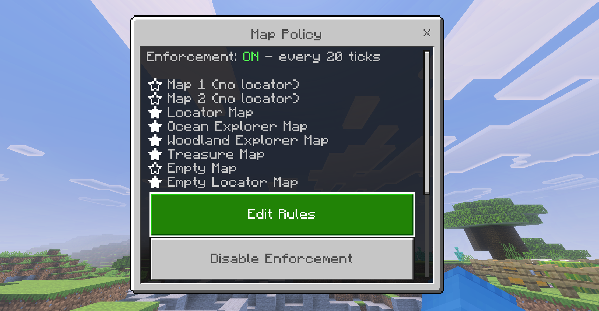

# MapDisabler
This is a Minecraft Bedrock Behavior Pack addon that allows you to choose which allows you to choose which maps get cleared from player's inventories in game.

# Setup
1. Download the [latest release](https://github.com/NoVa-Gh0ul/MapDisabler/releases)
2. Apply the pack to your world/realm/server, ensure Cheats and Beta API's are enabled
3. Type `!maps` in chat to change settings for the addon!

By default regular locator maps are disabled. If you want to temporarily disable the addon without removing it, you can press the "Disable Enforcement" button in the menu.